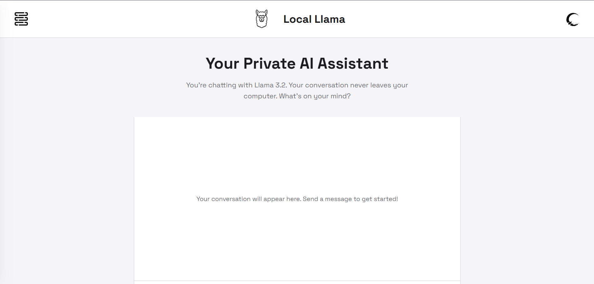

# Local Llama Chat UI

A clean, modern, and fully responsive web interface for interacting with your locally hosted [Ollama](https://ollama.com/) instance, powered by Llama 3.2. All conversations are 100% private and processed entirely on your own machine.

 

---

## ✨ Features

-   **100% Private:** Your prompts and the AI's responses never leave your computer.
-   **Real-time Typing Effect:** AI responses are streamed to the UI character-by-character for a dynamic feel.
-   **Responsive Design:** A seamless experience on desktop, tablet, and mobile.
-   **Dark & Light Modes:** Easy on the eyes, day or night.
-   **Slide-out History Panel:** The UI is ready for conversation history management (functionality coming soon).

## 🚀 How It Works

This project is a static frontend built with pure **HTML, CSS, and vanilla JavaScript**. It does not require a complex server or build steps.

1.  A user enters a prompt in the chat interface.
2.  The JavaScript `fetch` API sends a POST request to your local Ollama server's `/api/generate` endpoint.
3.  Ollama processes the prompt using the `llama3.2` model on your machine.
4.  Once the full response is received, the JavaScript dynamically creates a new message bubble.
5.  The text from the response is then "typed" out character-by-character into the message bubble.

## ⚙️ Setup

To run this project, you need to have Ollama installed and running.

1.  **Install Ollama:** Follow the instructions on the [Ollama website](https://ollama.com/).

2.  **Pull the Model:** Open your terminal and run the following command to download Llama 3.2:
    ```bash
    ollama serve
    ```

3.  **Run the Frontend:**
    -   Clone this repository.
    -   Ensure your images are placed in the `/static/image/` folder.
    -   Simply open the `index.html` file in your web browser. (For best results, use a live server extension in your code editor, like VS Code's "Live Server").

## 🔮 Future Updates

This is an active project and may be updated. Planned improvements include:

-   [ ] True end-to-end streaming of API responses.
-   [ ] Functional conversation history (saving and loading chats).
-   [ ] Markdown support for code blocks and lists in responses.
-   [ ] More robust error handling in the UI.